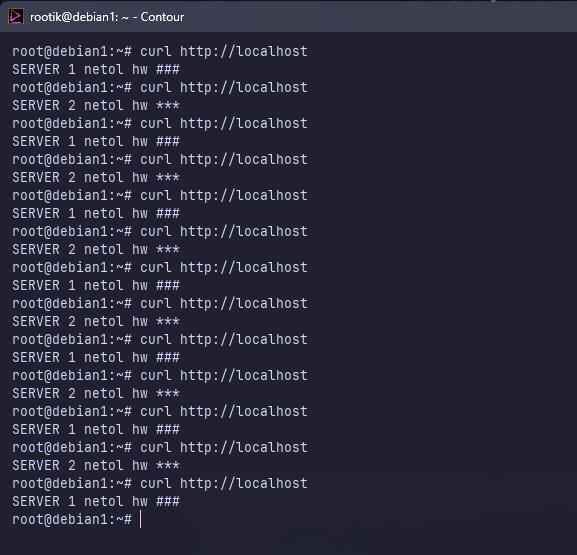
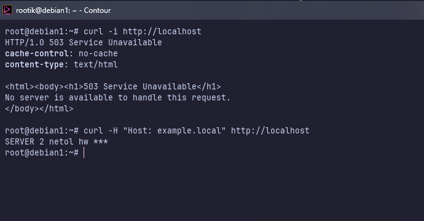
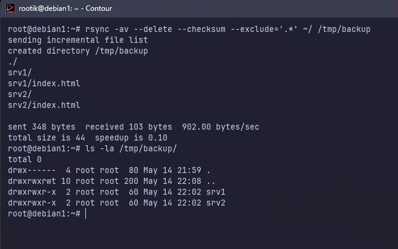
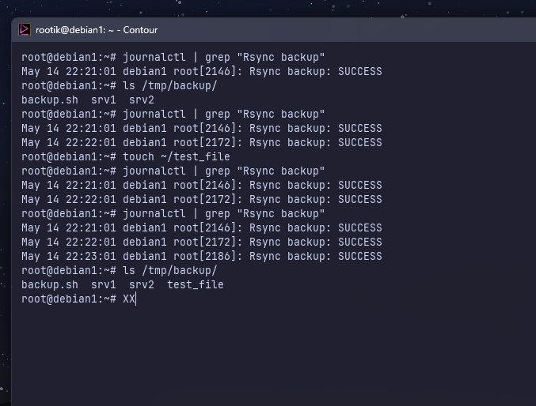

# Домашнее задание к занятию 2+3 «Кластеризация и балансировка нагрузки» + «Резервное копирование» - Нефедов Александр


# «Кластеризация и балансировка нагрузки»
## Задание 1
Запустите два simple python сервера на своей виртуальной машине на разных портах
Установите и настройте HAProxy, воспользуйтесь материалами к лекции по ссылке
Настройте балансировку Round-robin на 4 уровне.
На проверку направьте конфигурационный файл haproxy, скриншоты, где видно перенаправление запросов на разные серверы при обращении к HAProxy.




<details>
  <summary>haproxy.cfg:</summary>

```haproxy
listen homework_l4
    bind :80
    mode tcp
    balance roundrobin
    server srv1 127.0.0.1:8081 check
    server srv2 127.0.0.1:8082 check
```

</details>

---


## Задание 2
Запустите три simple python сервера на своей виртуальной машине на разных портах
Настройте балансировку Weighted Round Robin на 7 уровне, чтобы первый сервер имел вес 2, второй - 3, а третий - 4
HAproxy должен балансировать только тот http-трафик, который адресован домену example.local
На проверку направьте конфигурационный файл haproxy, скриншоты, где видно перенаправление запросов на разные серверы при обращении к HAProxy c использованием домена example.local и без него.




<details>
  <summary>haproxy.cfg:</summary>

```haproxy
frontend http_front
    bind :80
    mode http
    # Проверка домена example.local
    acl is_example hdr(host) -i example.local
    use_backend web_servers if is_example

backend web_servers
    mode http
    balance roundrobin
    # Настройка весов (2, 3, 4)
    server srv1 127.0.0.1:8081 weight 2 check
    server srv2 127.0.0.1:8082 weight 3 check
    server srv3 127.0.0.1:8083 weight 4 check
```

</details>


# «Резервное копирование»
## Задание 1
Составьте команду rsync, которая позволяет создавать зеркальную копию домашней директории пользователя в директорию /tmp/backup
Необходимо исключить из синхронизации все директории, начинающиеся с точки (скрытые)
Необходимо сделать так, чтобы rsync подсчитывал хэш-суммы для всех файлов, даже если их время модификации и размер идентичны в источнике и приемнике.
На проверку направить скриншот с командой и результатом ее выполнения

команда запуска:
```bash
rsync -av --delete --checksum --exclude='.*' ~/ /tmp/backup
```




## Задание 2
Написать скрипт и настроить задачу на регулярное резервное копирование домашней директории пользователя с помощью rsync и cron.
Резервная копия должна быть полностью зеркальной
Резервная копия должна создаваться раз в день, в системном логе должна появляться запись об успешном или неуспешном выполнении операции
Резервная копия размещается локально, в директории /tmp/backup
На проверку направить файл crontab и скриншот с результатом работы утилиты.

Crontab:
```bash
0 0 * * * * /root/backup.sh
```

backup.sh:
```bash
#!/bin/bash
# Создаем директорию, если её нет
mkdir -p /tmp/backup

# Запуск rsync с полными путями для надежности cron
if /usr/bin/rsync -av --delete --exclude='.*' /root/ /tmp/backup; then
    /usr/bin/logger "Rsync backup: SUCCESS"
else
    /usr/bin/logger "Rsync backup: ERROR"
fi
```



```
во время выполнения crontab был в конфигурации * * * * * * /root/backup.sh
```