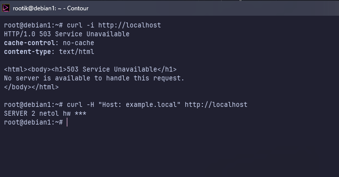

# Домашнее задание к занятию 2 «Кластеризация и балансировка нагрузки»
# - Нефедов Александр


# «Кластеризация и балансировка нагрузки»
## Задание 1
Запустите два simple python сервера на своей виртуальной машине на разных портах
Установите и настройте HAProxy, воспользуйтесь материалами к лекции по ссылке
Настройте балансировку Round-robin на 4 уровне.
На проверку направьте конфигурационный файл haproxy, скриншоты, где видно перенаправление запросов на разные серверы при обращении к HAProxy.


<details>
  <summary>haproxy.cfg</summary>

```haproxy
listen homework_l4
    bind :80
    mode tcp
    balance roundrobin
    server srv1 127.0.0.1:8081 check
    server srv2 127.0.0.1:8082 check
```

</details>

---


## Задание 2
Запустите три simple python сервера на своей виртуальной машине на разных портах
Настройте балансировку Weighted Round Robin на 7 уровне, чтобы первый сервер имел вес 2, второй - 3, а третий - 4
HAproxy должен балансировать только тот http-трафик, который адресован домену example.local
На проверку направьте конфигурационный файл haproxy, скриншоты, где видно перенаправление запросов на разные серверы при обращении к HAProxy c использованием домена example.local и без него.




<details>
  <summary>haproxy.cfg</summary>

```haproxy
frontend http_front
    bind :80
    mode http
    # Проверка домена example.local
    acl is_example hdr(host) -i example.local
    use_backend web_servers if is_example

backend web_servers
    mode http
    balance roundrobin
    # Настройка весов (2, 3, 4)
    server srv1 127.0.0.1:8081 weight 2 check
    server srv2 127.0.0.1:8082 weight 3 check
    server srv3 127.0.0.1:8083 weight 4 check
```

</details>
