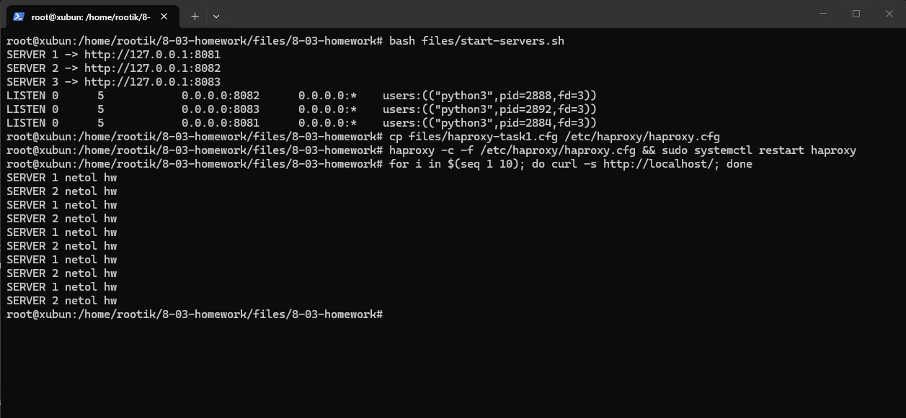
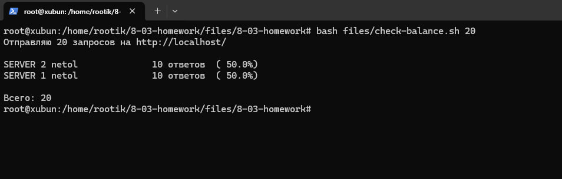
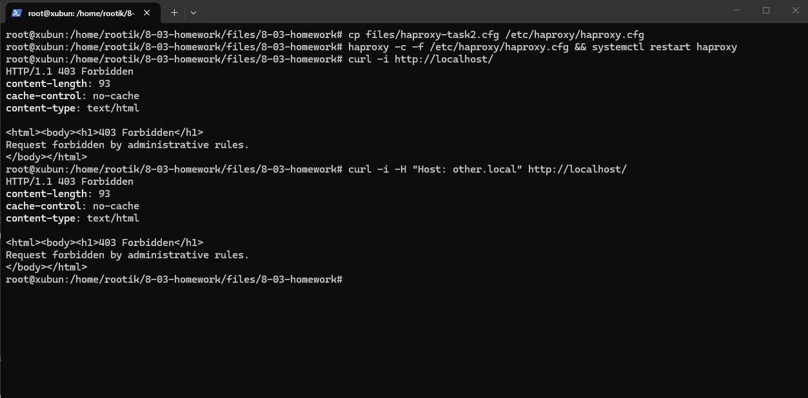
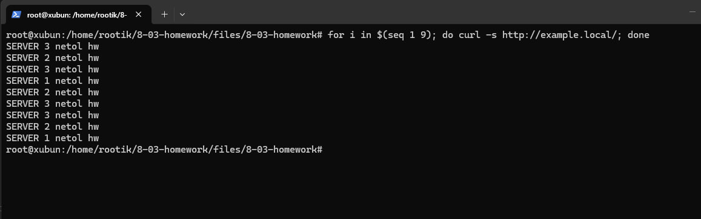
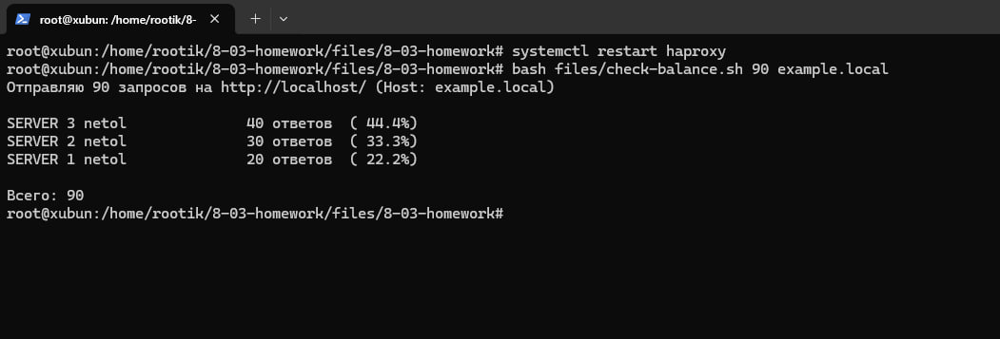
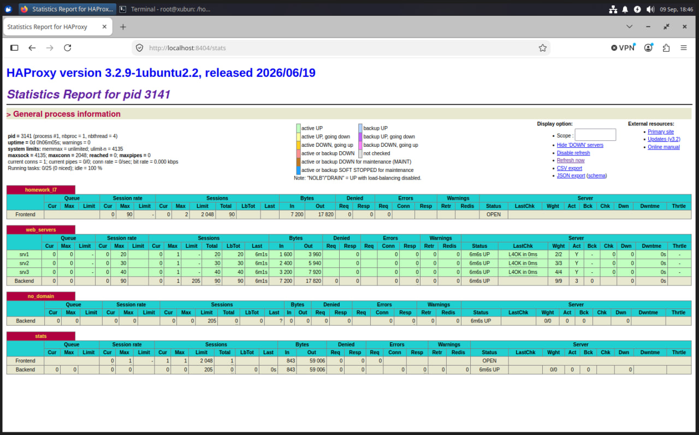

# Домашнее задание к занятию 2 «Кластеризация и балансировка нагрузки»
### Нефедов Александр

Конфигурационные файлы[`files/`](files/):

| Файл | Описание |
|------|------------|
| [`files/haproxy-task1.cfg`](files/haproxy-task1.cfg) | конфигурация HAProxy для задания 1 (L4, round-robin) |
| [`files/haproxy-task2.cfg`](files/haproxy-task2.cfg) | конфигурация HAProxy для задания 2 (L7, weighted round-robin + ACL по домену) |
| [`files/start-servers.sh`](files/start-servers.sh) | запуск simple python серверов на портах 8081–8083 |
| [`files/check-balance.sh`](files/check-balance.sh) | сбор статистики распределения запросов между бэкендами |

---

## Задание 1

Запустите два simple python сервера на своей виртуальной машине на разных портах.
Установите и настройте HAProxy, воспользуйтесь материалами к лекции по ссылке.
Настройте балансировку Round-robin на 4 уровне.
На проверку направьте конфигурационный файл haproxy, скриншоты, где видно перенаправление запросов на разные серверы при обращении к HAProxy.

### Решение

Конфигурационный файл: **[files/haproxy-task1.cfg](files/haproxy-task1.cfg)**

Ключевой блок — `mode tcp`, то есть балансировка происходит на 4 уровне,
HAProxy не разбирает HTTP и распределяет сами TCP-соединения:

```
listen homework_l4
    bind :80
    mode tcp
    balance roundrobin
    server srv1 127.0.0.1:8081 check
    server srv2 127.0.0.1:8082 check
```

Развёртывание:

```bash
sudo apt update && sudo apt install -y haproxy
sudo bash files/start-servers.sh
sudo cp files/haproxy-task1.cfg /etc/haproxy/haproxy.cfg
sudo haproxy -c -f /etc/haproxy/haproxy.cfg   # проверка синтаксиса
sudo systemctl restart haproxy
```

Проверка — запросы поочерёдно уходят на SERVER 1 и SERVER 2:

```bash
for i in $(seq 1 10); do curl -s http://localhost/; done
```



Статистика по 20 запросам (`./files/check-balance.sh 20`) — распределение 50/50:



---

## Задание 2

Запустите три simple python сервера на своей виртуальной машине на разных портах.
Настройте балансировку Weighted Round Robin на 7 уровне, чтобы первый сервер имел вес 2, второй — 3, а третий — 4.
HAProxy должен балансировать только тот http-трафик, который адресован домену example.local.
На проверку направьте конфигурационный файл haproxy, скриншоты, где видно перенаправление запросов на разные серверы при обращении к HAProxy c использованием домена example.local и без него.

### Решение

Конфигурационный файл: **[files/haproxy-task2.cfg](files/haproxy-task2.cfg)**

Здесь используется `mode http` (7 уровень) — HAProxy разбирает заголовок `Host`
и направляет в балансируемый бэкенд только запросы к `example.local`,
остальные получают 403:

```
frontend homework_l7
    bind :80
    mode http
    acl is_example hdr(host) -i example.local
    use_backend web_servers if is_example
    default_backend no_domain

backend web_servers
    mode http
    balance roundrobin
    server srv1 127.0.0.1:8081 weight 2 check
    server srv2 127.0.0.1:8082 weight 3 check
    server srv3 127.0.0.1:8083 weight 4 check
```

Развёртывание:

```bash
sudo cp files/haproxy-task2.cfg /etc/haproxy/haproxy.cfg
sudo haproxy -c -f /etc/haproxy/haproxy.cfg
sudo systemctl restart haproxy
```

#### Обращение **без** домена example.local

Запрос не попадает в балансируемый бэкенд — HAProxy отвечает 403:

```bash
curl -i http://localhost/
curl -i -H "Host: other.local" http://localhost/
```



#### Обращение **с** доменом example.local

Запросы распределяются между тремя серверами:

```bash
for i in $(seq 1 9); do curl -s -H "Host: example.local" http://localhost/; done
```



#### Проверка весов 2 : 3 : 4

90 запросов (9 полных циклов round-robin) — распределение соответствует весам:

```bash
./files/check-balance.sh 90 example.local
```

| Сервер | Вес | Ожидаемая доля | Фактически получено |
|--------|-----|----------------|---------------------|
| srv1 (8081) | 2 | 2/9 ≈ 22,2 % → 20 запросов | 20 |
| srv2 (8082) | 3 | 3/9 ≈ 33,3 % → 30 запросов | 30 |
| srv3 (8083) | 4 | 4/9 ≈ 44,4 % → 40 запросов | 40 |



Те же цифры в колонке *Sessions Total* на встроенной странице статистики
HAProxy (`http://<ip>:8404/stats`):


