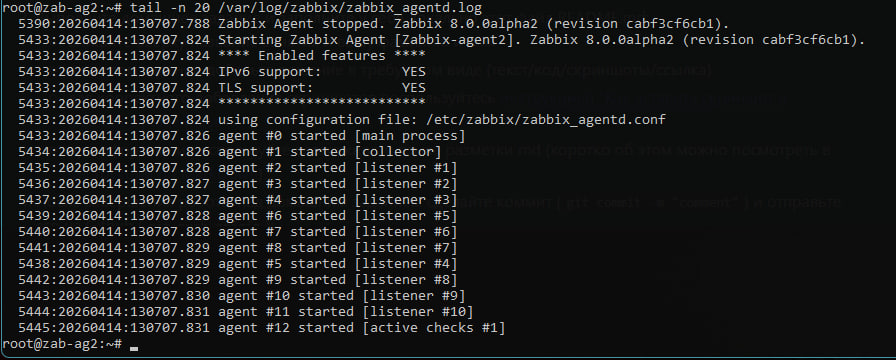
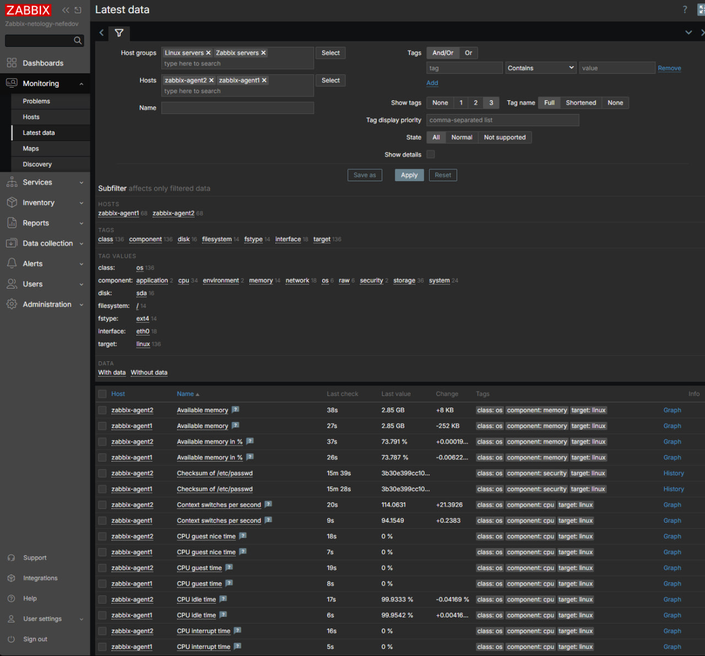

# Домашнее задание к занятию 3 «Резервное копирование»
# - Нефедов Александр


# «Резервное копирование»
## Задание 1
Составьте команду rsync, которая позволяет создавать зеркальную копию домашней директории пользователя в директорию /tmp/backup
Необходимо исключить из синхронизации все директории, начинающиеся с точки (скрытые)
Необходимо сделать так, чтобы rsync подсчитывал хэш-суммы для всех файлов, даже если их время модификации и размер идентичны в источнике и приемнике.
На проверку направить скриншот с командой и результатом ее выполнения

команда запуска
```bash
rsync -av --delete --checksum --exclude='.*' ~/ /tmp/backup
```




## Задание 2
Написать скрипт и настроить задачу на регулярное резервное копирование домашней директории пользователя с помощью rsync и cron.
Резервная копия должна быть полностью зеркальной
Резервная копия должна создаваться раз в день, в системном логе должна появляться запись об успешном или неуспешном выполнении операции
Резервная копия размещается локально, в директории /tmp/backup
На проверку направить файл crontab и скриншот с результатом работы утилиты.

Crontab
```bash
0 0 * * * * /root/backup.sh
```

backup.sh
```bash
#!/bin/bash
# Создаем директорию, если её нет
mkdir -p /tmp/backup

# Запуск rsync с полными путями для надежности cron
if /usr/bin/rsync -av --delete --exclude='.*' /root/ /tmp/backup; then
    /usr/bin/logger "Rsync backup: SUCCESS"
else
    /usr/bin/logger "Rsync backup: ERROR"
fi
```



 ```cron
>во время выполнения crontab был в конфигурации * * * * * * /root/backup.sh
> ```
